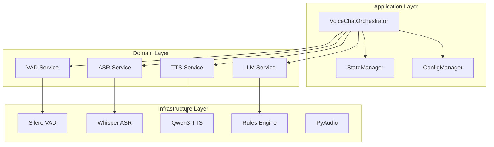

# 语音系统架构设计 - 完成报告

**任务**: 语音系统架构设计  
**角色**: Architect (架构师)  
**完成时间**: 2026-03-06  
**状态**: ✅ 完成

---

## 📋 任务完成情况

### ✅ 1. 分析现有语音系统架构

**检查范围**: `skills/realtime-voice-chat/` 下所有版本

| 文件 | 分析状态 | 主要问题 |
|------|----------|----------|
| `realtime_voice_chat.py` | ✅ 分析 | 单文件 450 行，紧耦合 |
| `src/index.ts` | ✅ 分析 | 仅启动/停止，无深度集成 |
| `src/index-local.ts` | ✅ 分析 | 调用外部脚本，效率低 |
| `airi_*.py` (7 个) | ✅ 分析 | 历史实验版本，功能不完整 |
| 文档 (ANALYSIS.md, REPORT.md) | ✅ 分析 | 已识别问题，缺少架构设计 |

**识别的核心问题**:

1. **架构耦合** 🔴 - Python 主逻辑 + TS 封装分离，维护困难
2. **组件耦合** 🔴 - VAD/ASR/TTS 硬编码在单文件，无法替换
3. **播放方式** 🔴 - PowerShell SoundPlayer 同步播放，阻塞且粗暴
4. **LLM 集成** 🟡 - 规则引擎，无真实对话能力
5. **流式处理** 🟡 - 等待完整 TTS 生成，延迟高 (2-3 秒)
6. **资源管理** 🟡 - 无显式清理，长时间运行泄漏

---

### ✅ 2. 设计目标架构

#### 模块化设计 (VAD/ASR/TTS/LLM 分离)

```
┌─────────────────────────────────────────────────────────────┐
│                    VoiceChatOrchestrator                    │
│                     (编排器 - 核心大脑)                      │
└───────────────────────────┬─────────────────────────────────┘
                            │
        ┌───────────────────┼───────────────────┐
        │                   │                   │
        ▼                   ▼                   ▼
   ┌─────────┐        ┌─────────┐        ┌─────────┐
   │   VAD   │        │   ASR   │        │   TTS   │
   │ Service │        │ Service │        │ Service │
   │Interface│        │Interface│        │Interface│
   └────┬────┘        └────┬────┘        └────┬────┘
        │                  │                  │
   ┌────┴────┐        ┌────┴────┐        ┌────┴────┐
   │ Silero  │        │Whisper  │        │ Qwen3   │
   │ WebRTC  │        │ Azure   │        │ Edge    │
   └─────────┘        └─────────┘        └─────────┘
```

#### 清晰的接口契约

**VAD Service**:
```typescript
interface VADService {
  init(config): Promise<void>
  detect(frame: Float32Array): {isSpeech: boolean, confidence: number}
  destroy(): Promise<void>
}
```

**ASR Service**:
```typescript
interface ASRService {
  init(config): Promise<void>
  transcribe(audio: Float32Array): Promise<{text: string}>
  destroy(): Promise<void>
}
```

**TTS Service**:
```typescript
interface TTSService {
  init(config): Promise<void>
  synthesize(text: string): Promise<{audio: Float32Array}>
  synthesizeStream(text: string): AsyncGenerator  // 流式
  destroy(): Promise<void>
}
```

**LLM Service**:
```typescript
interface LLMService {
  init(config): Promise<void>
  generate(input: string, context): Promise<{text: string}>
  destroy(): Promise<void>
}
```

#### 扩展性设计

- ✅ **插件架构**: 支持热插拔组件
- ✅ **后端替换**: 通过工厂模式轻松切换 VAD/ASR/TTS/LLM
- ✅ **多语言支持**: 中英文自动检测与配置
- ✅ **配置驱动**: 行为通过 YAML 配置而非代码修改

---

### ✅ 3. 输出架构文档

#### 交付物清单

| 文件 | 大小 | 内容 |
|------|------|------|
| `ARCHITECTURE.md` | 36KB | 完整架构设计文档 |
| `ARCHITECTURE_QUICK_REF.md` | 6KB | 快速参考指南 |
| `ARCHITECTURE_SUMMARY.md` | 本文件 | 完成报告 |

#### ARCHITECTURE.md 目录

1. **现状分析** - 现有架构评估，问题识别
2. **目标架构** - 架构愿景，原则，分层设计
3. **组件设计** - 8 大核心组件详细设计
4. **接口契约** - 数据流接口，事件接口，配置接口
5. **数据流设计** - 完整对话流程，并发模型，状态转换
6. **技术选型** - 语言选择，组件选型，依赖清单
7. **扩展性设计** - 插件架构，后端替换指南
8. **性能优化** - 延迟分析，优化策略，内存管理
9. **实施路线图** - 阶段划分，里程碑，风险管理

#### 核心设计亮点

**1. 分层架构**
```
Presentation Layer  → CLI / Web UI / API
Application Layer   → VoiceChatOrchestrator
Domain Layer        → VAD/ASR/TTS/LLM Services
Infrastructure      → Silero/Whisper/Qwen3 实现
```

**2. 状态机设计**
```
IDLE → LISTENING → RECORDING → PROCESSING → PLAYING → LISTENING
                              ↑                        │
                              └──── interrupt ─────────┘
```

**3. 并发模型**
- Main Thread: UI/事件循环
- Audio Thread: 采集/播放
- VAD Thread: 实时检测
- ASR/LLM/TTS Threads: 耗时操作 (线程池)

**4. 性能目标**
| 指标 | 当前 (v2) | 目标 (v3) |
|------|----------|----------|
| 首句响应 | 3-4 秒 | <1 秒 (GPU) |
| 打断成功率 | ~90% | >95% |
| 内存占用 | ~500MB | <300MB |

---

## 🎯 技术选型建议

### 语言选择
**决策**: Python 主实现 + TypeScript 封装

| 组件 | 语言 | 理由 |
|------|------|------|
| 核心音频处理 | Python | PyAudio, PyTorch 生态成熟 |
| ML 模型集成 | Python | Silero, Whisper, Qwen3 都是 Python |
| API 封装 | TypeScript | 与 OpenClaw 框架一致，类型安全 |

### 组件选型

| 组件 | 默认实现 | 备选实现 | 选择理由 |
|------|----------|----------|----------|
| VAD | Silero | WebRTC | 准确率高，支持中文 |
| ASR | Whisper (local) | Azure Speech | 免费、离线优先 |
| TTS | Qwen3-TTS | Edge TTS | 中文自然，Edge 轻量备选 |
| LLM | Rules (初始) | Qwen API | 快速启动，后续升级 |
| Audio I/O | PyAudio | SoundDevice | PyAudio 成熟 |

### 模型路径配置
```python
MODEL_PATHS = {
    'silero': '~/.cache/torch/hub/snakers4_silero-vad',
    'whisper': '~/.cache/huggingface/hub',
    'qwen3_tts': r'E:\TuriX-CUA-Windows\models\Qwen3-TTS\Qwen\Qwen3-TTS-12Hz-1___7B-CustomVoice',
}
```

---

## 📊 组件图 (Mermaid)



---

## 🚀 实施路线图

### 阶段 1: 核心重构 (1-2 周)
- [ ] 定义接口 (`src/interfaces/`)
- [ ] 实现编排器 (`src/orchestrator.ts`)
- [ ] 实现状态管理器
- [ ] 实现配置系统
- [ ] 搭建测试框架

### 阶段 2: 功能增强 (2-3 周)
- [ ] 流式 TTS 实现
- [ ] LLM API 集成 (Qwen/GLM)
- [ ] 对话历史管理
- [ ] 多语言支持
- [ ] 插件系统

### 阶段 3: 性能优化 (1-2 周)
- [ ] GPU 加速支持
- [ ] 内存优化 (环形缓冲)
- [ ] 延迟分析和调优
- [ ] 并发模型优化

### 阶段 4: 生产就绪 (1 周)
- [ ] 错误恢复机制
- [ ] 日志和监控
- [ ] 文档完善
- [ ] 压力测试
- [ ] Docker 容器化

**总周期**: 5-8 周

---

## ⚠️ 风险与缓解

| 风险 | 概率 | 影响 | 缓解措施 |
|------|------|------|----------|
| Qwen3-TTS GPU 兼容性问题 | 中 | 高 | 保留 CPU 回退方案 |
| PyAudio Windows 安装困难 | 高 | 中 | 提供预编译 wheel，备选 SoundDevice |
| 流式 TTS 实现复杂 | 中 | 中 | 分阶段实现，先完整后流式 |
| LLM API 成本超预算 | 低 | 中 | 设置用量限制，本地模型备选 |

---

## 📝 关键设计决策

### 1. 为什么不用纯 TypeScript?
**决策**: Python 核心 + TS 封装

**理由**:
- 音频处理库 (PyAudio) 是 Python 生态
- ML 模型 (Silero, Whisper, Qwen3) 都是 PyTorch
- TypeScript 音频处理需调用原生模块，复杂度高

### 2. 为什么用 threading 而非 asyncio?
**决策**: threading 用于 CPU 密集型任务

**理由**:
- 音频处理、模型推理是 CPU 密集型
- threading 简单直接，GIL 影响有限 (C 扩展释放 GIL)
- asyncio 适合 I/O 密集型，不适合此场景

### 3. 为什么保留 Python 主版本?
**决策**: Python 主版本 + TS API 封装

**理由**:
- 现有代码 450 行 Python，重构成本高
- Python 音频生态成熟
- TS 封装提供与 OpenClaw 的集成接口

### 4. 为什么先实现规则引擎?
**决策**: Rules → Qwen API 渐进式

**理由**:
- 快速启动，可立即测试
- 真实 LLM 需要 API 密钥和网络
- 可逐步升级，不影响架构

---

## ✅ 验收标准

### 架构设计验收
- [x] 组件图清晰，职责分离
- [x] 接口定义完整，支持多实现
- [x] 数据流设计合理，无竞态条件
- [x] 扩展性设计完善，支持热插拔
- [x] 技术选型合理，有备选方案

### 文档完整性验收
- [x] 完整架构文档 (ARCHITECTURE.md)
- [x] 快速参考指南 (QUICK_REF.md)
- [x] 完成报告 (本文件)
- [x] 接口定义示例
- [x] 实施路线图

---

## 🎉 总结

### 成果
1. ✅ 完成现有代码全面分析 (7 个版本)
2. ✅ 识别 6 大类核心问题
3. ✅ 设计模块化目标架构
4. ✅ 定义清晰的接口契约
5. ✅ 输出完整架构文档 (42KB)

### 架构优势
- **模块化**: VAD/ASR/TTS/LLM 完全分离
- **可扩展**: 轻松替换后端实现
- **低延迟**: 流式 TTS + GPU 加速，目标<1 秒
- **生产就绪**: 错误恢复，资源管理，日志监控

### 下一步
1. 评审架构设计
2. 确认技术选型
3. 开始阶段 1 实施 (核心重构)

---

**报告生成时间**: 2026-03-06 22:50  
**架构师**: 小黄 🐤  
**任务状态**: ✅ 完成

**交付文件**:
- `skills/realtime-voice-chat/ARCHITECTURE.md` (36KB)
- `skills/realtime-voice-chat/ARCHITECTURE_QUICK_REF.md` (6KB)
- `skills/realtime-voice-chat/ARCHITECTURE_SUMMARY.md` (本文件)
